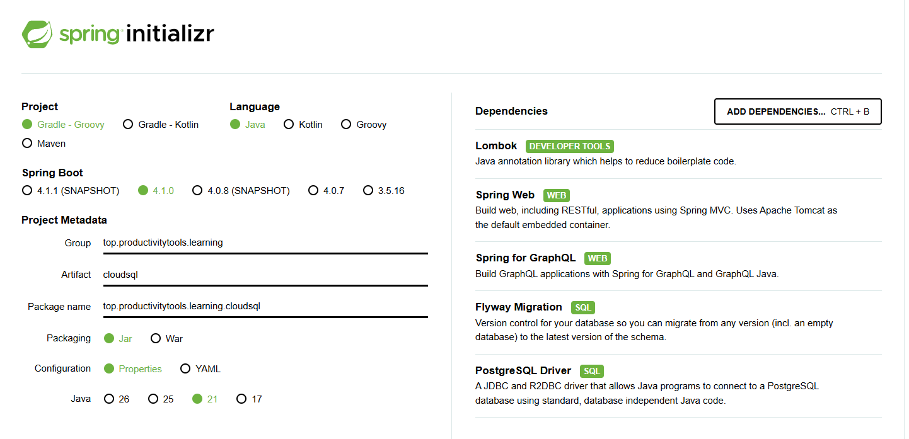

```
.\gradlew.bat wrapper
.\gradlew.bat bootrun
```

build container
```
.\gradlew.bat bootBuildImage --imageName=gcr.io/pwujczyklearning/cloudsql-app
```


```
gcloud artifacts repositories create learning-cloudsql     --repository-format=docker --location=europe-central2 --description="Docker repository for CloudSQL learning app"
```

```
gcloud projects add-iam-policy-binding pwujczyk-net-1     --member="serviceAccount:1034282302531-compute@developer.gserviceaccount.com" --role="roles/run.admin"

gcloud projects add-iam-policy-binding pwujczyk-net-1  --member="serviceAccount:1034282302531-compute@developer.gserviceaccount.com"    --role="roles/iam.serviceAccountUser" --condition=None
```